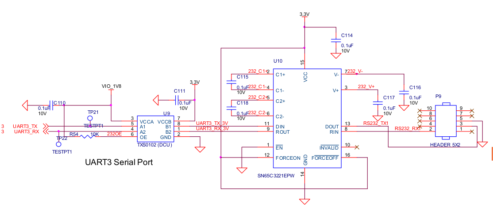
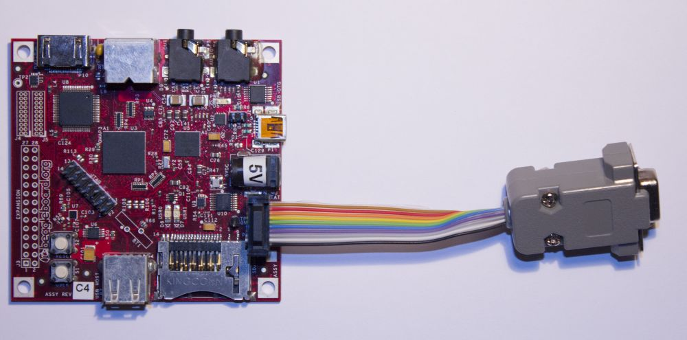

Beagleboard* with Angstrom distribution
======================================

\* revision C4

## 1. Hardware

### 1.1 Power

The BeagleBoard can be powered in two ways, using the USB on-the-go connector (the small USB
connector on the BB, marked yellow), and using the 5V input. 5V input is recommended, USB 
often can't provide enough current when the board is under load (for example, Linux loading 
breaks without the 5V input).

### 1.2 Serial output

BeagleBoard has one RS232 port with RS232 compatible voltage levels (from now on mentioned as 
serial port or serial output). It is connected to the P9 connector, TX to pin 3 and RX to pin
2. Reference GND can be found on pin 5.

For connecting to the serial output, this cable has been assembled:

Cable attaches to the P9 connector, with cable's IDC connector pin 1 (a little arrow on the 
black connector) connecting to the P9 pin 1.

**Note:** BeagleBoard's serial output consists only of the RX, TX signals and the common GND. 
Handshaking signals are not available. Because of that, the cable has internal loopback on 
the handshaking signals on the computer side. That enables PC applications to use hardware
handshaking, even though it's not supported.

### 1.3 USB networking

BeagleBoard has no Ethernet port, but there exists a support for USB based networking. In 
that solution, BeagleBoard connects to the PC like a USB peripheral, through the USB on-the-go
port (small one, marked yellow).

